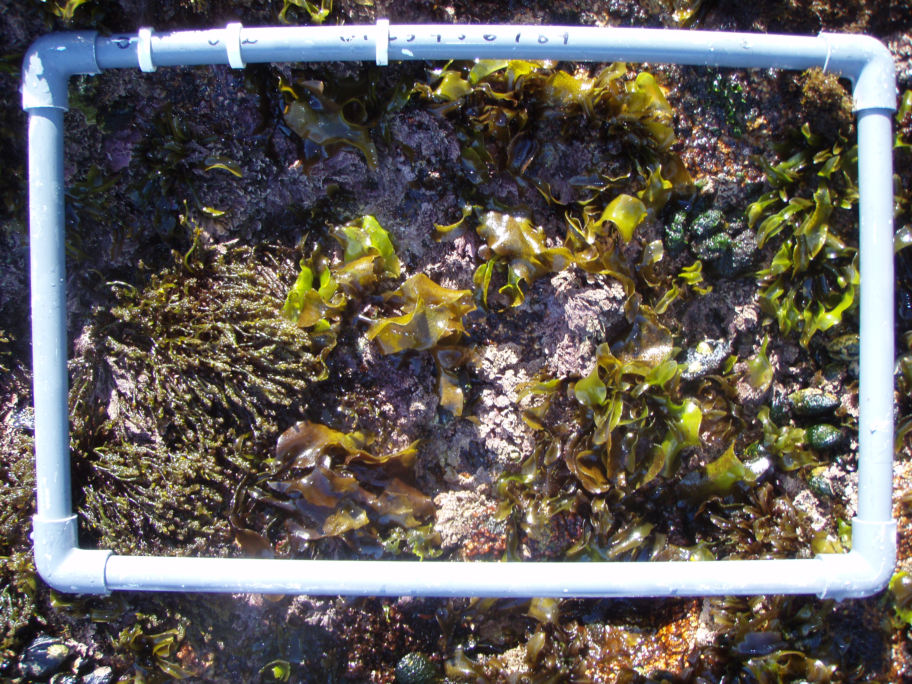

# Elizabeth Max's Master of Science Thesis 2024

## Climate-related changes in rocky intertidal species distribution on the Farallon Islands

### **About this GitPage** 
This GitPage serves as an open-source publication of the methods used to wrangle and analyze the data I used for my masters project. Below are Rmarkdowns with the code that I used in addition to the data visualizations that I created in RStudio. All maps were created by me in ArcGIS Pro. All photos were taken by me. 

# Project Overview
This project focuses on the species cover of rocky intertidal alage and invertebrates on the Farallon Islands. Cover data is sourced from annual surveys executed by the [**Greater Farallones National Marine Sanctuary**](https://farallones.noaa.gov/science/intertidal.html) in the time period of 1993-2011. The relationship of environmental variables and species cover are central to this analysis.  
The seminal paper on this research by Roletto et. al found that upright algal and sessile vertebrate species were decreasing while crusting species and bare rock were increasing. My research aimed to investigate the drivers behind this trend of ecological simplification in a climate change context. Read [**this paper by Roletto et. al, 2014**](https://bioone.org/journals/monographs-of-the-western-north-american-naturalist/volume-7/issue-1/042.007.0120/Status-and-Trends-of-the-Rocky-Intertidal-Community-on-the/10.3398/042.007.0120.full) to learn more about the survey methods and the initial findings regarding the status and trends of rocky intertidal species cover on the Farallon Islands 1993-2011.

## The Farallon Islands
The Farallon Islands are a string of 7 granite islands about 5 miles long that rest about 30 miles west of San Francisco, CA and 5 miles east of the continental shelf (Office of National Marine Sanctuaries, 2017). These granite islands host diverse marine and terrestrial species and are influenced by upwelling in the California Current, one of the world's most productive regions (Capitolo, 2009). The relative inaccessibility and protection of the Farallones make their rocky intertidal habitats suitable for studying ecological changes with minimal direct human disturbance (Lucas & Smith, 2016; White, 1995).

## Southeast Farallon Islands and Survey Site Map
Since 1993, GFNMS biologists have conducted annual rocky intertidal surveys on the two South Farallon Islands: Maintop (or West End) and Southeast Farallon Island (SEFI) (Roletto et al., 2014). Six long-term study areas exist on the two largest South Farallon Islands.

## Quadrat Sample
Each site had three to four permanent quadrats, placed in the middle and high intertidal zones. Due to the steep terrain of most rocky intertidal sites on the Farallones, these zones are narrow at most locations. A random number system was used to choose the direction and distance from each permanent quadrat resulting in about 1 to 3 randomly placed quadrats. All quadrats were 30 x 50 cm (0.15m2) and underwent point-intercept sampling of 50 points each, one point for each equal-sized rectangle in a grid. Tidepools, all sea stars, mobile invertebrates, and highly rugose areas were avoided in both the permanent and random quadrats.

## **Research Questions** 
1. Are variations in air temperature, sea surface temperature (SST), and sea surface salinity (SSS) associated with changes in cover? 
2. Does cover respond to ocean-climate patterns ([**NPGO**](https://www.psl.noaa.gov/gcos_wgsp/Timeseries/NPGO/), [**PDO**](https://www.ncei.noaa.gov/access/monitoring/pdo/), [**SOI**](https://www.ncei.noaa.gov/access/monitoring/enso/soi), [**CUTI, and BEUTI**](https://mjacox.com/upwelling-indices/))? 
3. Are the biogeographical range shifts that are seen on the mainland exhibited on the islands? 

# Tidying the Dataset with R 
RMarkdowns, performed in the following order:
1. [**Formatting**](https://elizabethmax.github.io/SEFI-Intertidal-1993-2011/Tidying_Data.1_Format.html)  
2. [**Dealing with NA and Zeroes**](https://elizabethmax.github.io/SEFI-Intertidal-1993-2011/Tidying_Data.2_NA.and.Zeroes.html)  
3. [**Species Name Corrections**](https://elizabethmax.github.io/SEFI-Intertidal-1993-2011/Tidying_Data.3_Name.Corrections.html) 

# Research Question 1
### Are variations in air temperature, sea surface temperature (SST), and sea surface salinity (SSS) associated with changes in cover?
This questions addresses the relationship between species cover and local-scale environmental variables. Species were separated into three groups: 1) all upright species - this includes algae and sessile invertebrates; 2) upright, non-crusting algae; 3) sessile non-crusting invertebrates. Crusting organisms like sponges, bryozoans, and crustose algae were excluded from analysis because my question is about trends in cover of this non-crustose category specifically.  
All combinations of SST, air temperature, SSS, and the interactive effects of SST and SSS come out to 45 combinations. In the interest of choosing the best linear mixed model, AIC analysis was applied to all possible candidate models.

[**AIC Analysis RMarkdown for Question 1**](https://elizabethmax.github.io/SEFI-Intertidal-1993-2011/AIC-Analysis-Q1.html)

### Results Table for Question 1
AIC ranked top models for all categories in Question 1. The plus sign "+" indicates additive variables, the colon ":" represents the interaction between variables. The low R-squared values indicate that other ecological factors are affecting cover of upright species.

| Category of Upright Species Cover | Top Model | R-squared |
|:----------------------------------|:----------|:----------|
| All | Air temp + SSS | 0.035 |
| Algae | SSS | 0.007 |
| Invertebrates | SST:SSS | 0.008 |

# Research Question 2
### Does cover respond to ocean-climate patterns NPGO, PDO, SOI, CUTI, and BEUTI?
This question investigates the relationship between large-scale ocean patterns and species cover. All combinations of NPGO, PDO, SOI, CUTI, and BEUTI come out to 96 linear mixed models. Again, AIC was used to find the top model and the low R-squared values indicate that other ecological factors are affecting cover of upright species.

**[AIC Analysis RMarkdown for Question 2](https://elizabethmax.github.io/SEFI-Intertidal-1993-2011/AIC-Analysis-Q2.html)**

### Results Table for Question 2

| Category of Upright Species Cover |          Top Model        | R-squared |
|:----------------------------------|:--------------------------|:----------|
| All                               | NPGO + SOI + CUTI + BEUTI |   0.101   |
| Algae                             | NPGO + PDO + CUTI + BEUTI |   0.037   |
| Invertebrates                     |            SOI            |   0.003   |  

# Research Question 3
### Are the biogeographical range shifts that are seen on the mainland exhibited on the islands?
Key species were chosen based on being identified as a species of interest for this region and by meeting the northern and southern classification criteria (Barry et al., 1995; Blanchette et al., 2008; Burton, 1998; Duncan et al., 2013; Raimondi et al., 2019; Sanford et al., 2019). 
 
I chose the Mann-Kendall test for its ability to identify monotonic (increasing/decreasing) trends which is respresented by the z statistic. [Click here to read more about the Mann-Kendall test]()  

### Biogeographical Range Map for California Rocky Intertidal Species
Northern species group has a southern range boundary north of Point Conception, California.
Southern species group has a northern range boundary south of Cape Mendocino.
Cosmopolitan species group have a geographic range that exceed both the northern and southern range boundaries.
 

**[Mann-Kendall Test RMarkdown for Question 3](https://elizabethmax.github.io/SEFI-Intertidal-1993-2011/Q3.-Poleward_Range_Shift.html)**

### Z-scores from the Mann-Kendall Test by species to determine range shifts.
Positive z-scores indicate an increasing trend, negative z-scores indicate a decreasing trend.
 
An asterisk indicates a significant p-value (less than 0.05).  
Ae = _Anthopleura elegantissima_, Ax = _Anthopleura xanthogrammica_, Bs = _Balanus_ spp., Cg = _Cladophora graminea_, Cp = _Callithamnion pikeanum_, Cv = _Corallina vancouveriensis_, Ee = _Egregia menziesii_, Eu = _Endocladia muricata_, Gs = _Gelidium_ spp., Mb = _Microcladia borealis_, Mi = _Microcladia coulteri_, Ms = _Mastocarpus_ spp., Mv = _Myriogramme variegata_*, My = _Mytilus californianus_, Nl = _Neorhodomela larix_, Ns = _Neogastroclonium subarticulatum_, Os = _Osmundea spectabilis_, Pl = _Polysiphonia savatieri_, Pp = _Pollicipes polymerus_, Py = _Porphyra_ spp., Tr = _Tetraclita rubescens_, Us = _Ulva_ spp.
*_Myriogramme variegata_ is put in the Southern group because it is considered rare, typically hyperlocal to Pacific Grove, California (Abbott & Hollenberg, 1976).

### Z-scores by species range groups
 

# Species Boxplots 
For curious minds, below are the boxplots for species of interest.

[Boxplot RMarkdown](https://elizabethmax.github.io/SEFI-Intertidal-1993-2011/Species_DataViz.html)   
[*Tetraclita rubescens*](https://elizabethmax.github.io/SEFI-Intertidal-1993-2011/TetraAllSqrt.png)  
[*Mytilus californianus*](https://elizabethmax.github.io/SEFI-Intertidal-1993-2011/MytAllSqrt.png)  
[*Corallina vancouveriensis*](https://elizabethmax.github.io/SEFI-Intertidal-1993-2011/CorAllSqrt.png)  
[*Endocladia muricata*](https://elizabethmax.github.io/SEFI-Intertidal-1993-2011/EndoAllSqrt.png)  
[*Mastocarpus jardinii*](https://elizabethmax.github.io/SEFI-Intertidal-1993-2011/MastJAllSqrt.png)  
[*Mastocarpus papillatus*](https://elizabethmax.github.io/SEFI-Intertidal-1993-2011/MastPAllSqrt.png)  
[*Mazzaella affinis*](https://elizabethmax.github.io/SEFI-Intertidal-1993-2011/MazzAAllSqrt.png)  
[*Mazzaella flaccida*](https://elizabethmax.github.io/SEFI-Intertidal-1993-2011/MazzFAllSqrt.png)

